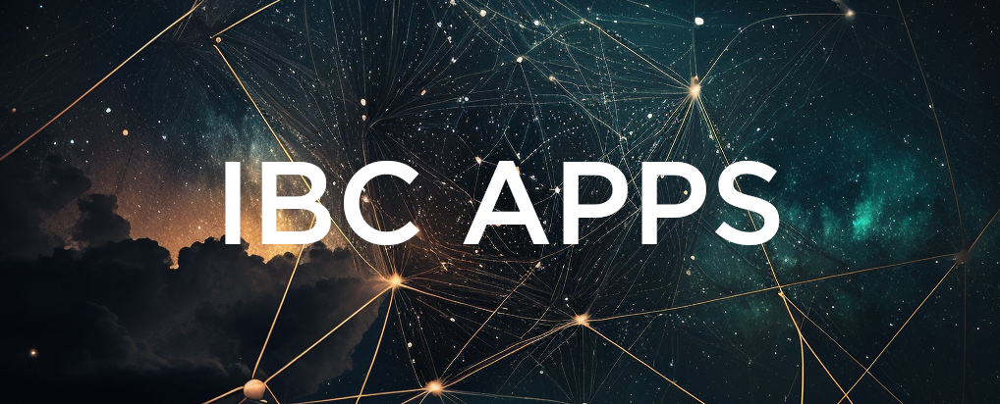

# ibc-apps

IBC applications and middleware for Cosmos SDK blockchains

🌌 Why have an ibc-apps repo?
================================

Early IBC work started in the [ibc-go](https://github.com/cosmos/ibc-go) repo. As the repo grew, the need arose to parallelize the work among many teams.  

The ibc-apps repo is meant to be an easily discoverable, navigable, central place for modules and middleware.

🌌🌌 Who's it for?
===================

IBC-Apps is for: 
- _Core **ibc-go** contributors_; it frees them from having to maintain IBC Apps,

- _Publishers of **ibc apps**_, so their apps can be easily found, and 

- _Everyone who uses IBC_ and wants to benefit from the full range of its capabilities.

🌌🌌🌌 What is it?
==================

### What is IBC?

The Inter-Blockchain Communication Protocol (IBC) is a protocol to handle the authentication and transport of data between two blockchains. IBC requires a minimal set of functions, specified in the [Interchain Standards](https://github.com/cosmos/ibc/tree/main/spec/ics-001-ics-standard) (ICS). These specifications do not limit the network topology or consensus algorithm, so IBC can be used with a wide range of blockchains or state machines. The IBC protocol provides a permissionless way for relaying data packets between blockchains, unlike most trusted bridging technologies. The security of IBC reduces to the security of the participating chains.

IBC solves a widespread problem: cross-chain communication. This problem exists on public blockchains when exchanges wish to perform swaps. The problem arises early in the case of application-specific blockchains, where every asset is likely to emerge from its own purpose-built chain. Cross-chain communication is also a challenge in the world of private blockchains, in cases where communication with a public chain or other private chains is desirable.

Cross-chain communication between application-specific blockchains in Cosmos creates the potential for high horizontal scalability with transaction finality. These design features provide convincing solutions to well-known problems that plague other platforms, such as transaction costs, network capacity, and transaction confirmation finality.

### What is an IBC App?

IBC apps can be split into two categories - modules and middleware.

IBC Modules are self-contained applications that enable packets to be sent to and received from other IBC-enabled chains.  IBC application developers do not need to concern themselves with the low-level details of clients, connections, and proof verification.

IBC Middleware are self-contained modules that sit between core IBC and an underlying IBC application.  This allows developers to customize lower-level packet handling.  Multiple middleware modules can be chained together.  

🌌🌌🌌🌌 How to Use this repo
==============================

If you'd like to include software in this repo, please see [contributing](./ibc-apps/CONTRIBUTING.md).

🌌🌌🌌🌌🌌 Bonus Content
=======================

🌌🌌🌌🌌 How to Use this repo
=============================

If you'd like to include software in this repo, please see [contributing](../ibc-apps/CONTRIBUTING.md).

🌌🌌🌌🌌🌌 Bonus Content
=============================

## Hello World

An [example IBC app](./examples/hello-world/)

## List of Apps

| Name | Type | Example | Stakeholders | Description |
| ---- | ---- | ------- | ------------ | ----------- |  
| [Async Interchain Query](./modules/async-icq/) | Module | Link | [Strangelove](https://github.com/strangelove-ventures/) | Interchain Queries enable blockchains to query the state of an account on another chain without the need for ICA auth. |
| [Packet Forward Middleware](./middleware/packet-forward-middleware) | Middleware | Link | [Strangelove](https://github.com/strangelove-ventures/) | Middleware for forwarding IBC packets. | 
